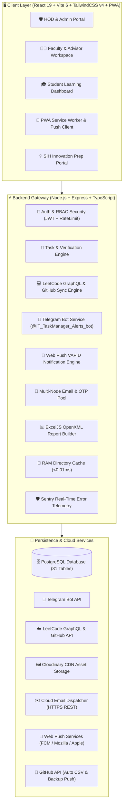
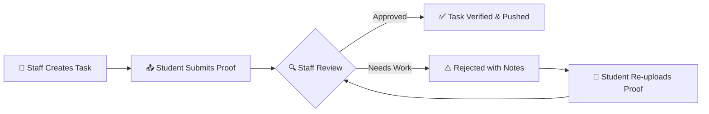
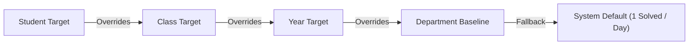

<div align="center">

# 🎓 IT TASK MANAGER & ACADEMIC MANAGEMENT SYSTEM
### *Enterprise Academic Governance, Live Coding Analytics, Web Push PWA & Automated Telegram Bot Engine*

[](https://www.typescriptlang.org/)
[](https://react.dev/)
[](https://vitejs.dev/)
[](https://tailwindcss.com/)
[](https://nodejs.org/)
[](https://expressjs.com/)
[](https://www.postgresql.org/)
[](https://it-taskmanager.vercel.app/)
[](https://web.dev/progressive-web-apps/)
[](https://core.telegram.org/bots/api)
[](https://sentry.io/)

<p align="center">
  <b>Department of Information Technology</b> • <b>VSB Engineering College, Karur</b>
</p>

---

</div>

## 📌 Executive Summary

**IT Task Manager** is an enterprise-grade academic task tracking, coding analytics, and institutional governance platform engineered for educational institutions, faculty coordinators, department leadership (HODs), and students.

### Core Capabilities:
1. **Academic Task Governance**: Precision scope assignments (Individual, Class Section, Batch Year, Department), team submissions, multi-tier verification workflows, and structured opt-out governance.
2. **Live Coding Analytics (LeetCode & GitHub)**: Real-time synchronization of LeetCode problem velocity, student daily total GitHub commit counts, 4-level target inheritance, and automated defaulter tracking.
3. **Automated Telegram Bot Engine (`@IT_TaskManager_Alerts_bot`)**: Register Number instant lookup, class/year analysis shortcuts (`/3ita`, `/2it`, `/year3`) with section breakdowns, private deadline reminders, and daily department briefs.
4. **Progressive Web App (PWA) & Web Push Notifications**: Native desktop & mobile PWA installability with background Service Worker sync, persistent VAPID key infrastructure, and real-time push alerts for task dispatches, verifications, and deadlines.
5. **Institutional Reporting Suite**: Direct OpenXML `.xlsx` generation across 9 specialized formats with dynamic boundary trimming and zero file corruption via ExcelJS.
6. **Automated Cloud Sync & Database Snapshots**: 11:55 PM IST daily LeetCode CSV auto-export pushed to GitHub, alongside daily 31-table JSON snapshot backups with 30-day rolling retention.
7. **Automated Email Dispatch & Security OTP Engine**: Multi-node load-balanced email delivery with instant failover, 4 institutional notification streams, and self-service 1-click easy copy OTP password reset.
8. **Observability & Smart India Hackathon (SIH) Suite**: Sentry production error telemetry, rate-limiting security, and a dedicated SIH preparation portal for student innovation teams.

---

## ⚡ Vercel Production Deployment & Architecture

> **Repository Designation**: This repository (`Tharun4743/taskmanager`) is specifically configured and optimized for live continuous deployment on the **[Vercel](https://vercel.com/)** platform.

- **🌐 Live Production URL**: [https://it-taskmanager.vercel.app/](https://it-taskmanager.vercel.app/)
- **📁 Dedicated Vercel Reference Folder**: [`vercel/`](./vercel/README.md)
- **📄 Root Vercel Specification**: [`VERCEL.md`](./VERCEL.md)
- **⚙️ Core Configuration**: [`vercel.json`](./vercel.json)

### Key Vercel Specifications:
| Parameter | Specification | Details |
| :--- | :--- | :--- |
| **Framework Preset** | Vite / Node.js | Fast modern frontend bundling with TypeScript |
| **Build Command** | `npm run build` | Compiles optimized single-page application into `dist/` |
| **Output Directory** | `dist` | Production client static distribution folder |
| **Edge Region** | `bom1` (Mumbai, India) | Ultra-low latency edge routing for institutional users |
| **Serverless Entrypoint** | `api/index.ts` | Express.js bridge with 1536 MB RAM & 30s max execution duration |
| **Asset Caching** | Immutable Caching | `public, max-age=31536000, immutable` on `/assets/(.*)` |
| **SPA Rewrites** | HTML5 PushState | Clean fallback to `/index.html` for client routing |

---

## 🏛️ High-Level System Architecture



---

## 🔄 Core Workflows

### 1. Academic Task Lifecycle



### 2. Multi-Level Target Priority Resolver



---

## 🌟 Feature Modules

### Module 1: Academic Task Governance & Collaborative Teams
- **Granular Scoping**: Assign tasks to individual students, class sections (e.g., IT-A, IT-B, IT-C), academic years, or the entire department.
- **Team-Based Submissions**: Configurable group sizes (2–5 members), interactive invitation banners, leader/member role badges, and single consolidated proof submission with leader override.
- **Review & Resubmission**: Instant rejection alert banners with detailed staff feedback, history tracking, and 1-click proof re-upload.
- **Opt-Out Governance**: Structured student participation opt-out tracking with mandatory justification logging for faculty audit.
- **Threaded Discussions**: In-task interactive discussion threads with `@mentions` and real-time alerts.

### Module 2: Coding Competency Tracking (LeetCode & GitHub)
- **LeetCode Engine**: Live tracking of total solved problems, daily solve velocity, Easy/Medium/Hard breakdown, and daily/weekly target completion status via LeetCode GraphQL API.
- **GitHub Engine**: Real-time synchronization of daily total commit counts per student with weekly aggregate metrics and commit streak indicators.
- **Combined Coding Matrix**: Side-by-side progress monitor displaying student LeetCode statistics and daily total GitHub commits with multi-tier class & year filtering.
- **Defaulter Detection**: Automated identification of students missing daily problem solving quotas or deadline requirements.

### Module 3: Automated Telegram Bot Engine
- **Bot Username**: `@IT_TaskManager_Alerts_bot`
- **Instant Student Lookup**: Anyone can send a student's Register Number (e.g., `922524205001`) or `/check <reg_no>` for a full performance scorecard.
- **Class & Year Analysis Shortcuts**:
  - `/3ita`, `/3itb`, `/3itc`, `/2ita`, `/2itb` $\rightarrow$ Class section report with active assignments and incomplete student lists.
  - `/2it`, `/3it`, `/year2`, `/year3` $\rightarrow$ Academic year batch report with **Section-Wise Breakdown** (IT-A, IT-B, IT-C overview).
- **Scheduled Automated Reminders**:
  - `20:00 IST`: Private 1-to-1 alert sent to students with pending deadlines due within 24 hours.
  - `21:00 IST`: Formatted department group summary with ASCII completion gauges (`[██████░░] 75%`).
  - PostgreSQL persistent locks (`system_settings`) prevent duplicate dispatches on server restarts.

### Module 4: Progressive Web App (PWA) & Web Push Notification Engine
- **Native PWA Installation**: Complete PWA manifest (`manifest.json`), service worker (`sw.js`), and custom responsive install prompt overlay (`PWAInstallOverlay.tsx`).
- **Web Push Notifications (`pushNotificationService.ts`)**: Standards-compliant Web Push protocol with automatic VAPID keypair generation and PostgreSQL persistence.
- **Multi-Event Background Dispatch**: Instant push alerts triggered on new task publications, submission status updates (Verified / Rejected), and approaching deadline alarms.
- **Device Management**: Automatic registration and synchronization of multiple browser subscriptions per student/faculty account.

### Module 5: Professional Excel Reporting Suite
- Pure **ExcelJS** OpenXML generator eliminating XML formatting errors, memory leaks, and blank margins.
- Official institutional header with auto-calculated column widths, custom color-coded status badges, and print area pinning.
- Supported formats: HOD Master Task Report, LeetCode Daily & Weekly Reports, GitHub Activity Reports, Combined Coding Matrices, and Department Defaulters Lists.

### Module 6: Automated Cloud Sync & Database Snapshots
- **11:55 PM IST Daily LeetCode CSV Auto-Push**: Generates datewise master and section-wise CSV reports (`leetcode/LeetCode_Daily_Report_YYYY-MM-DD.csv`, `leetcode/YYYY-MM-DD/Section_*.csv`) and automatically commits and pushes them to GitHub via GitHub Contents API & Git CLI.
- **Automated Database Snapshots**: Every 24 hours, captures all 31 PostgreSQL tables in `backups/db_backup_*.json` and pushes snapshots to GitHub with a 30-day rolling retention policy.
- **RAM Directory Auto-Sync**: In-memory student cache (< 0.01ms lookups) with auto-push to GitHub on profile updates.

### Module 7: Enterprise Automated Email System & Security OTP Engine
- **Self-Service 6-Digit Email OTP Password Reset**: Automated verification pipeline with 10-minute expiry window, 3-attempt brute-force protection, and 1-tap/1-click instant copy container.
- **Multi-Node Load Balanced Email Pool**: High-availability multi-node architecture with round-robin load distribution and automated zero-downtime failover over secure HTTPS REST protocol.
- **4 Core Academic Notification Streams**:
  - *New Task Assignment*: Automatic notification broadcast to assigned classes upon task publication.
  - *Submission Verification*: Official approval memorandum with evaluation badge and faculty feedback.
  - *Submission Rejection*: Real-time correction notice with reviewer remarks and direct resubmission portal link.
  - *Incomplete Task 2-Hour Deadline Alert*: Automated background scanner triggering final-call urgency emails for incomplete students.
- **Institutional Academic Letterhead**: Formal government & college letterhead embedding the official institutional emblem (`logo.png`), NAAC 'A' Grade accreditation banner, and reference tracking.

### Module 8: Observability, Security & Smart India Hackathon (SIH) Suite
- **Sentry Real-Time Telemetry**: Production error capture, stack trace diagnosis, and 20% trace sampling rate for performance observability.
- **Security & Hardening**: Bcrypt salted password hashing, JWT stateless authentication, sanitized multi-identifier logins (College Email / Register No), and IP rate limiting.
- **SIH Preparation Portal**: Dedicated innovation management space featuring problem statement tracking, domain classification, and submission guidelines.

---

## 👥 Role-Based Access Control (RBAC) Matrix

| Capability / Resource | Supreme Admin | HOD | Year Coordinator | Class Advisor | Class Coordinator | Student |
| :--- | :---: | :---: | :---: | :---: | :---: | :---: |
| **All Departments Administration** | ✅ | ❌ | ❌ | ❌ | ❌ | ❌ |
| **Department-Wide Scope** | ✅ | ✅ | ❌ | ❌ | ❌ | ❌ |
| **Academic Year Scope** | ✅ | ✅ | ✅ | ❌ | ❌ | ❌ |
| **Class Section Scope** | ✅ | ✅ | ✅ | ✅ | ✅ | ❌ |
| **Create & Assign Tasks** | ✅ | ✅ | ✅ | ✅ | ✅ | ❌ |
| **Verify / Reject Submissions** | ✅ | ✅ | ✅ | ✅ | ✅ | ❌ |
| **Manage Coding Target Thresholds** | ✅ | ✅ | ✅ | ✅ | ✅ | ❌ |
| **Trigger Telegram Broadcasts** | ✅ | ✅ | ✅ | ✅ | ✅ | ❌ |
| **Export Official Excel Reports** | ✅ | ✅ | ✅ | ✅ | ✅ | ❌ |
| **Configure Department Notices** | ✅ | ✅ | ✅ | ✅ | ✅ | ❌ |
| **Submit Task Proofs & Link Bot** | ❌ | ❌ | ❌ | ❌ | ❌ | ✅ |
| **Create & Manage Project Teams** | ❌ | ❌ | ❌ | ❌ | ❌ | ✅ |
| **Subscribe to Web Push Alerts** | ✅ | ✅ | ✅ | ✅ | ✅ | ✅ |

---

## 🔒 Intellectual Property & Proprietary License

```
Copyright (c) 2024–2026 Techsquad. All Rights Reserved.
Department of Information Technology, VSB Engineering College.
```

### Terms & Restrictions of Use:
- **Strictly Proprietary**: This software, including its source code, database architectures, user interface assets, analytics pipelines, and documentation, is the exclusive intellectual property of **Techsquad** and the Department of Information Technology at VSB Engineering College.
- **Unauthorized Copying Prohibited**: No individual or entity may clone, copy, distribute, modify, decompile, reverse-engineer, sublicense, publicly host, or commercially exploit this software or its source code, in whole or in part, without prior express written permission from the copyright owner.
- **Institutional Exclusivity**: Engineered exclusively for internal academic governance and student coding analytics within VSB Engineering College.
- **Legal Enforcement**: Any unauthorized use, reproduction, or infringement of these proprietary assets is strictly prohibited and subject to legal remedies under applicable intellectual property and copyright laws.

For permissions, authorized deployment inquiries, or official institutional requests:
- **Lead Architect & Developer**: [Techsquad](https://techsquadsih.netlify.app/)
- **Department**: Department of Information Technology, VSB Engineering College, Karur, Tamil Nadu, India.

---

<div align="center">

### 🏛️ Department of Information Technology
**VSB Engineering College, Karur – 639111, Tamil Nadu, India**  
*An Autonomous Institution • Accredited by NAAC with 'A' Grade • Approved by AICTE*

Made with ❤️ by **[Techsquad](https://techsquadsih.netlify.app/)**

</div>

