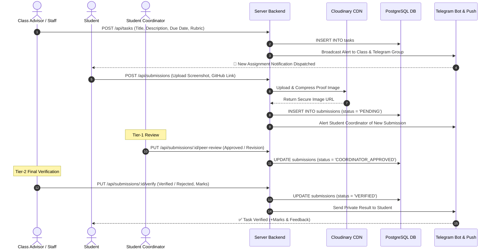
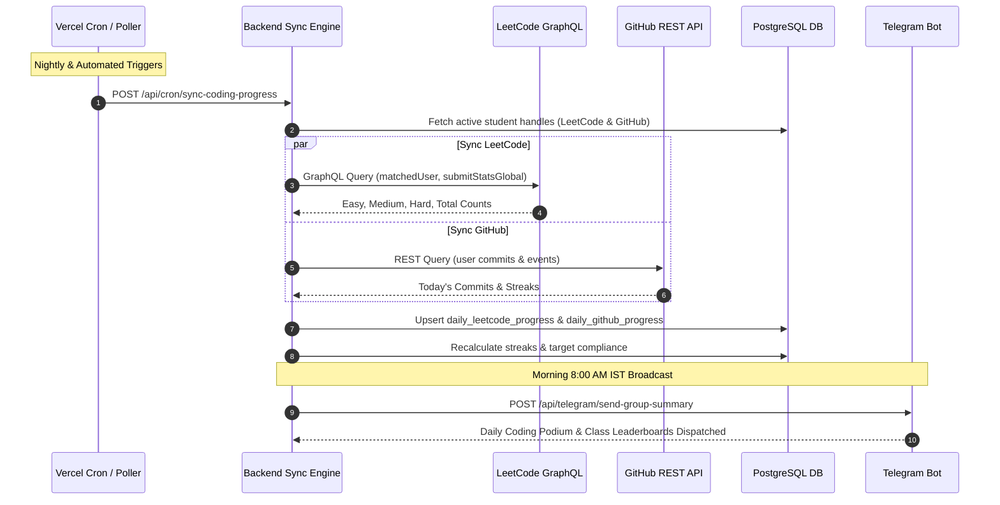
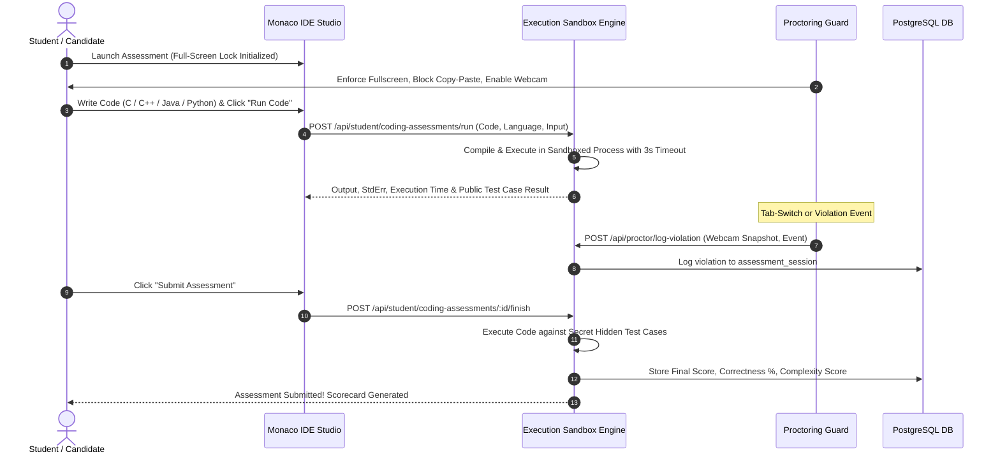
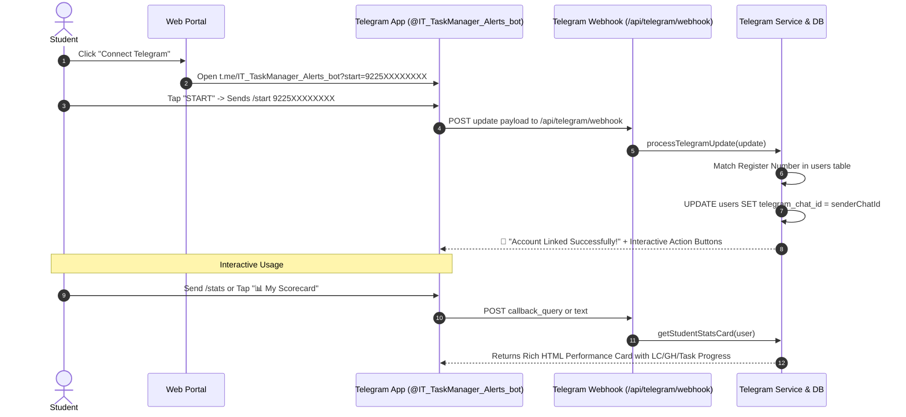

# 🏛️ IT TaskManager — Role-Based Access Control (RBAC), Features & End-to-End Workflows

This document provides a comprehensive, deep-dive specification of all user roles, granular access privileges, interactive dashboard features, and end-to-end operational workflows in the **Academia–Industry Integrated Platform & IT Task Manager** (VSB Engineering College, Department of Information Technology).

---

## 📑 Table of Contents
1. [RBAC Security Architecture & Governance Model](#1-rbac-security-architecture--governance-model)
2. [Master Roles Matrix & Authority Hierarchy](#2-master-roles-matrix--authority-hierarchy)
3. [Deep-Dive Role Specifications & Capabilities](#3-deep-dive-role-specifications--capabilities)
   - [3.1 Supreme Admin (`SUPREME_ADMIN`)](#31-supreme-admin-supreme_admin)
   - [3.2 Head of Department (`HOD`)](#32-head-of-department-hod)
   - [3.3 Class Advisor / Faculty Advisor (`CLASS_ADVISOR`)](#33-class-advisor--faculty-advisor-class_advisor)
   - [3.4 Subject Faculty / Teaching Staff (`STAFF`)](#34-subject-faculty--teaching-staff-staff)
   - [3.5 Student Coordinator / Peer Reviewer (`COORDINATOR`)](#35-student-coordinator--peer-reviewer-coordinator)
   - [3.6 Undergraduate Student (`STUDENT`)](#36-undergraduate-student-student)
   - [3.7 Corporate HR / Talent Acquisition Partner (`INDUSTRY`)](#37-corporate-hr--talent-acquisition-partner-industry)
4. [End-to-End Operational Workflows](#4-end-to-end-operational-workflows)
   - [Workflow 1: Academic Task Lifecycle & 3-Tier Verification](#workflow-1-academic-task-lifecycle--3-tier-verification)
   - [Workflow 2: LeetCode & GitHub Momentum Tracking](#workflow-2-leetcode--github-momentum-tracking)
   - [Workflow 3: Sandboxed Coding Qualifier & Anti-Cheat Exam](#workflow-3-sandboxed-coding-qualifier--anti-cheat-exam)
   - [Workflow 4: Telegram Bot Automated Alerting & 1-Click Linking](#workflow-4-telegram-bot-automated-alerting--1-click-linking)
   - [Workflow 5: Corporate Recruitment & Candidate Shortlisting](#workflow-5-corporate-recruitment--candidate-shortlisting)
5. [Complete API Endpoint Authorization Matrix](#5-complete-api-endpoint-authorization-matrix)

---

## 1. RBAC Security Architecture & Governance Model

The platform enforces strict **Multi-Tiered Role-Based Access Control (RBAC)** across the presentation layer (React 19), application server (Express.js), and database layer (PostgreSQL).

```
┌─────────────────────────────────────────────────────────────────────────────┐
│                            SUPREME_ADMIN                                    │
│             (Full Institutional Control & System Governance)                │
└──────────────────────────────────────┬──────────────────────────────────────┘
                                       │
┌──────────────────────────────────────▼──────────────────────────────────────┐
│                                 HOD                                         │
│               (Departmental Oversight, Analytics & Approvals)               │
└──────────────────┬───────────────────────────────────────┬──────────────────┘
                   │                                       │
┌──────────────────▼──────────────────┐ ┌──────────────────▼──────────────────┐
│           CLASS_ADVISOR             │ │               STAFF                 │
│ (Class Roster, Tasks, Coding Goals) │ │    (Subject Tasks & Grading)        │
└──────────────────┬──────────────────┘ └──────────────────┬──────────────────┘
                   │                                       │
┌──────────────────▼───────────────────────────────────────▼──────────────────┐
│                             COORDINATOR                                     │
│                (Student Peer Review & 1st-Tier Verification)                │
└──────────────────────────────────────┬──────────────────────────────────────┘
                                       │
┌──────────────────────────────────────▼──────────────────────────────────────┐
│                               STUDENT                                       │
│          (Task Submissions, Coding Arena, Proctored Assessments)            │
└─────────────────────────────────────────────────────────────────────────────┘
                                       │
┌──────────────────────────────────────┴──────────────────────────────────────┐
│                              INDUSTRY                                       │
│          (Recruitment Hub, Coding Challenges, Candidate Scoring)            │
└─────────────────────────────────────────────────────────────────────────────┘
```

### Key Security Principles:
- **Stateless JWT Tokens**: Signed with `JWT_SECRET`, carrying `userId`, `role`, `class_id`, and `is_coordinator` claims.
- **Middleware Guard (`authorize([...])`)**: Intercepts requests and enforces HTTP 403 Forbidden on unauthorized operations.
- **Class Isolation**: Faculty advisors and coordinators can only modify data belonging to their assigned class sections, while HOD and Supreme Admin have department-wide visibility.

---

## 2. Master Roles Matrix & Authority Hierarchy

| Capability / Module | `SUPREME_ADMIN` | `HOD` | `CLASS_ADVISOR` | `STAFF` | `COORDINATOR` | `STUDENT` | `INDUSTRY` |
| :--- | :---: | :---: | :---: | :---: | :---: | :---: | :---: |
| **System Settings & Backups** | ✅ Full | 👁️ Read | ❌ | ❌ | ❌ | ❌ | ❌ |
| **Department & Class Creation** | ✅ Full | ✅ Full | ✅ Class | ❌ | ❌ | ❌ | ❌ |
| **User & Student Provisioning** | ✅ Full | ✅ Full | ✅ Own Class | ❌ | ❌ | ❌ | ❌ |
| **Coordinator Designation** | ✅ | ✅ | ✅ Own Class | ❌ | ❌ | ❌ | ❌ |
| **Task Creation & Rubrics** | ✅ | ✅ | ✅ | ✅ | ❌ | ❌ | ❌ |
| **Task Submissions** | ❌ | ❌ | ❌ | ❌ | ❌ | ✅ | ❌ |
| **Tier-1 Peer Review** | ❌ | ❌ | ❌ | ❌ | ✅ | ❌ | ❌ |
| **Final Task Verification** | ✅ | ✅ | ✅ | ✅ | ❌ | ❌ | ❌ |
| **Batch Verification** | ✅ | ✅ | ✅ | ❌ | ❌ | ❌ | ❌ |
| **LeetCode Target Assignment** | ✅ | ✅ | ✅ | ❌ | ✅ | ❌ | ❌ |
| **LeetCode/GitHub Live Tracking** | ✅ | ✅ | ✅ | ✅ | ✅ | ✅ (Own) | ❌ |
| **Aptitude Test Submission** | ❌ | ❌ | ❌ | ❌ | ❌ | ✅ | ❌ |
| **Sandboxed Coding Assessment** | ❌ | ❌ | ❌ | ❌ | ❌ | ✅ | ❌ |
| **Industry Qualifier Creation** | ✅ | ❌ | ❌ | ❌ | ❌ | ❌ | ✅ |
| **HR Candidate Scorecard Export** | ✅ | ✅ | ❌ | ❌ | ❌ | ❌ | ✅ |
| **Telegram Broadcast & Triggers** | ✅ | ✅ | ✅ | ✅ | ❌ | ❌ | ❌ |
| **Telegram Personal Bot Link** | ✅ | ✅ | ✅ | ✅ | ✅ | ✅ | ❌ |

---

## 3. Deep-Dive Role Specifications & Capabilities

---

### 3.1 Supreme Admin (`SUPREME_ADMIN`)

**Primary Role**: Chief Institutional Administrator with unrestricted access to system infrastructure, database maintenance, role provisioning, and audit logs.

#### Capabilities & Features:
1. **System Administration & Database Health**:
   - Trigger full database schema migrations (`POST /api/admin/init-db`).
   - Export full encrypted database snapshots in JSON format (`GET /api/admin/export-db-snapshot`).
   - Purge stale verification screenshots (>30 days) to optimize Cloudinary and storage costs (`POST /api/admin/purge-old-screenshots`).
2. **Organizational Hierarchy Management**:
   - Create, edit, and delete academic departments.
   - Provision class sections across all 4 academic years (`1-IT-A`, `2-IT-B`, `3-IT-C`, etc.).
   - Provision faculty advisors, HOD accounts, and corporate industry accounts.
3. **Telegram Webhook & Alerting Controls**:
   - Register, test, and delete Telegram Webhooks (`/api/telegram/set-webhook`, `/api/telegram/delete-webhook`).
   - Trigger department-wide broadcasts and daily summaries.
4. **Full System Visibility**:
   - Access student portfolios, submission proofs, LeetCode leaderboards, and audit trails without restriction.

---

### 3.2 Head of Department (`HOD`)

**Primary Role**: Departmental executive responsible for academic oversight, faculty governance, performance analytics, and institutional compliance.

#### Capabilities & Features:
1. **Department Analytics Command Center**:
   - View aggregated completion rates across all academic years (`I IT`, `II IT`, `III IT`, `IV IT`).
   - Identify defaulters across all sections in real-time.
   - Inspect daily LeetCode velocity and GitHub commit streaks department-wide.
2. **Academic Quality Assurance**:
   - Review and override task submissions, peer reviews, and faculty verifications.
   - Perform batch verification of completed assignments.
   - Reopen expired assignments for individual students or entire cohorts with custom extension deadlines.
3. **Department Communications**:
   - Dispatch daily evening summaries (9:00 PM IST) and 24h deadline alerts to the official Department Telegram Group.
   - Broadcast urgent notices to all student devices via Telegram and Web Push.
4. **Industry & Placement Oversight**:
   - View Placement Readiness Index (PRI 2.0) score distributions.
   - Inspect corporate assessment reports and candidate shortlists.

---

### 3.3 Class Advisor / Faculty Advisor (`CLASS_ADVISOR`)

**Primary Role**: Class-level faculty in charge of student rosters, task assignments, deadline enforcement, coding momentum, and academic verification.

#### Capabilities & Features:
1. **Class Roster & Student Management**:
   - Add new students or bulk-import entire class rosters via Excel/CSV spreadsheets.
   - Assign or revoke **Student Coordinator (`is_coordinator`)** status.
   - View and edit student academic profiles, register numbers, and contact details.
2. **Task Creation & Rubric Engine**:
   - Publish assignments with title, description, attachments, maximum marks, rubrics, and deadlines.
   - Target specific classes or individual students.
   - Configure submission requirements (image proof, GitHub repository link, live demo URL, notes).
3. **2nd-Tier Task Verification Pipeline**:
   - Inspect coordinator-approved submissions.
   - View high-resolution image proofs in fullscreen modal.
   - Verify with marks and feedback, or reject with corrective instructions.
   - Bulk-verify all pending submissions in one click.
4. **LeetCode Coding Target Allocation**:
   - Assign customized daily/weekly problem targets (Easy, Medium, Hard).
   - Set 4-level target inheritance (Department $\rightarrow$ Year $\rightarrow$ Class $\rightarrow$ Student).
   - Track live submission streaks and target compliance.
5. **Class Telegram & Reminder Triggers**:
   - Trigger 1-to-1 private Telegram reminders to pending students.
   - Generate section-wise OpenXML Excel submission reports.

---

### 3.4 Subject Faculty / Teaching Staff (`STAFF`)

**Primary Role**: Academic instructor managing coursework assignments and subject-specific evaluation.

#### Capabilities & Features:
1. **Subject Assignment Management**:
   - Create and schedule lab tasks, problem sets, and theoretical assignments.
   - Monitor live student submission progress bars.
2. **Grading & Feedback**:
   - Grade student submissions with rubrics.
   - Provide individualized improvement feedback.
3. **Student Scorecard Inspection**:
   - Access student coding velocity and skill profiles.

---

### 3.5 Student Coordinator / Peer Reviewer (`COORDINATOR`)

**Primary Role**: Top-performing student appointed by the Class Advisor to conduct 1st-tier peer review, verify submission authenticity, and mentor peers.

#### Capabilities & Features:
1. **1st-Tier Peer Review Queue**:
   - Dedicated Coordinator Workbench displaying submitted assignments from classmates.
   - Verify screenshot validity (e.g., verifying student register number in IDE/portal screenshot).
   - Approve submission to advance it to Class Advisor queue, or send back for revision with comments.
2. **Class Coding Target Assignment**:
   - Class-level coordinators can assign LeetCode problem targets to motivate classmates.
3. **Student Privileges Intact**:
   - Retains all standard student functionalities (submitting own tasks, taking tests, coding studio).

---

### 3.6 Undergraduate Student (`STUDENT`)

**Primary Role**: Primary learner engaging in academic tasks, daily algorithmic problem solving, proctored assessments, and career portfolio building.

#### Capabilities & Features:
1. **Task Submission Studio**:
   - View pending, submitted, verified, and rejected tasks categorized by urgency.
   - Upload screenshot proofs (automatically compressed and hosted via Cloudinary CDN).
   - Attach GitHub repository URLs, live deployment links, and explanatory notes.
   - View verification feedback and resubmit rejected tasks.
2. **Live Coding Analytics Studio**:
   - Automated synchronization with LeetCode GraphQL API (Easy, Medium, Hard, ranking, streak).
   - Automated synchronization with GitHub REST API v3 (Daily commit count, repository stats).
   - Track compliance against assigned weekly/daily targets.
   - Compete on the **Department Coding Leaderboard**.
3. **Multi-Language Sandboxed Compiler Studio**:
   - Integrated **Monaco IDE** (VS Code engine) with syntax highlighting, autocomplete, and dark mode.
   - Compile and execute code in **C, C++, Java 17, and Python 3**.
   - Test against public sample cases and hidden test cases with execution time/memory limits.
4. **Proctored Aptitude & MCQ Testing**:
   - Anti-cheat exam lockdown (fullscreen enforcement, tab-switch detection, copy-paste blocker).
   - Webcam snapshot verification.
   - Automated scoring, detailed category breakdown, and instant scorecard generation.
5. **Telegram Bot 1-Click Connection**:
   - Connect Telegram account via `@IT_TaskManager_Alerts_bot` with 1 click (`/link <Reg_No>`).
   - Receive private 24h deadline reminders, scorecards, and evaluation notices.
   - Interactive bot commands: `/tasks`, `/stats`, `/leetcode`, `/github`, `/leaderboard`.
6. **Career Portfolio & Placement Readiness Index (PRI 2.0)**:
   - Live readiness meter based on 4-pillar algorithmic evaluation.
   - AI-driven skill gap recommendations and target company tier matching.

---

### 3.7 Corporate HR / Talent Acquisition Partner (`INDUSTRY`)

**Primary Role**: Corporate recruiter evaluating candidate technical competence, creating assessment qualifiers, and hiring talent.

#### Capabilities & Features:
1. **Job & Internship Opportunity Posting**:
   - Publish company job descriptions, eligibility criteria, CTC packages, and interview dates.
2. **Custom Sandboxed Coding Qualifier Creation**:
   - Configure technical challenges with problem descriptions, initial code templates, constraints, public test cases, and secret test cases.
3. **Proctored Evaluation & Anti-Cheat Audit**:
   - Inspect candidate webcam snapshots captured during test sessions.
   - Review tab switch logs, copy-paste violation counts, and code diffs.
4. **Candidate Scorecard & Export Engine**:
   - View leaderboard of test takers sorted by score, execution time, and passing test cases.
   - Export comprehensive candidate scorecards as formatted **OpenXML Excel spreadsheets** (`.xlsx`) and printable **PDF reports**.

---

## 4. End-to-End Operational Workflows

---

### Workflow 1: Academic Task Lifecycle & 3-Tier Verification



---

### Workflow 2: LeetCode & GitHub Momentum Tracking



---

### Workflow 3: Sandboxed Coding Qualifier & Anti-Cheat Exam



---

### Workflow 4: Telegram Bot Automated Alerting & 1-Click Linking



---

## 5. Complete API Endpoint Authorization Matrix

### 🔐 Authentication & Session Endpoints
| Method | Route | Public | Student | Coordinator | Staff | Advisor | HOD | Admin | Industry |
| :--- | :--- | :---: | :---: | :---: | :---: | :---: | :---: | :---: | :---: |
| `POST` | `/api/auth/login` | ✅ | ✅ | ✅ | ✅ | ✅ | ✅ | ✅ | ✅ |
| `POST` | `/api/auth/forgot-password` | ✅ | ✅ | ✅ | ✅ | ✅ | ✅ | ✅ | ✅ |
| `POST` | `/api/auth/verify-otp` | ✅ | ✅ | ✅ | ✅ | ✅ | ✅ | ✅ | ✅ |
| `GET` | `/api/auth/me` | ❌ | ✅ | ✅ | ✅ | ✅ | ✅ | ✅ | ✅ |

### 📝 Academic Task Management
| Method | Route | Public | Student | Coordinator | Staff | Advisor | HOD | Admin | Industry |
| :--- | :--- | :---: | :---: | :---: | :---: | :---: | :---: | :---: | :---: |
| `GET` | `/api/tasks` | ❌ | ✅ | ✅ | ✅ | ✅ | ✅ | ✅ | ❌ |
| `POST` | `/api/tasks` | ❌ | ❌ | ❌ | ✅ | ✅ | ✅ | ✅ | ❌ |
| `PUT` | `/api/tasks/:id` | ❌ | ❌ | ❌ | ✅ | ✅ | ✅ | ✅ | ❌ |
| `DELETE` | `/api/tasks/:id` | ❌ | ❌ | ❌ | ❌ | ✅ | ✅ | ✅ | ❌ |
| `POST` | `/api/tasks/:id/reopen` | ❌ | ❌ | ❌ | ❌ | ✅ | ✅ | ✅ | ❌ |
| `POST` | `/api/submissions` | ❌ | ✅ | ✅ | ❌ | ❌ | ❌ | ❌ | ❌ |
| `PUT` | `/api/submissions/:id/peer-review`| ❌ | ❌ | ✅ | ❌ | ❌ | ❌ | ❌ | ❌ |
| `PUT` | `/api/submissions/:id/verify` | ❌ | ❌ | ❌ | ✅ | ✅ | ✅ | ✅ | ❌ |
| `POST` | `/api/submissions/batch-verify` | ❌ | ❌ | ❌ | ❌ | ✅ | ✅ | ✅ | ❌ |

### ⚡ Coding Arena, LeetCode & Sandboxed Compilers
| Method | Route | Public | Student | Coordinator | Staff | Advisor | HOD | Admin | Industry |
| :--- | :--- | :---: | :---: | :---: | :---: | :---: | :---: | :---: | :---: |
| `GET` | `/api/coding/dashboard` | ❌ | ✅ | ✅ | ✅ | ✅ | ✅ | ✅ | ❌ |
| `POST` | `/api/coding/sync-me` | ❌ | ✅ | ✅ | ✅ | ✅ | ✅ | ✅ | ❌ |
| `POST` | `/api/coding/targets` | ❌ | ❌ | ✅ | ❌ | ✅ | ✅ | ✅ | ❌ |
| `POST` | `/api/student/coding-assessments/run` | ❌ | ✅ | ✅ | ✅ | ✅ | ✅ | ✅ | ✅ |
| `POST` | `/api/student/coding-assessments/:id/start` | ❌ | ✅ | ❌ | ❌ | ❌ | ❌ | ❌ | ❌ |
| `POST` | `/api/student/coding-assessments/:id/finish`| ❌ | ✅ | ❌ | ❌ | ❌ | ❌ | ❌ | ❌ |

### 🤖 Telegram Bot & Automated Notifications
| Method | Route | Public | Student | Coordinator | Staff | Advisor | HOD | Admin | Industry |
| :--- | :--- | :---: | :---: | :---: | :---: | :---: | :---: | :---: | :---: |
| `POST` | `/api/telegram/webhook` | ✅ | ❌ | ❌ | ❌ | ❌ | ❌ | ❌ | ❌ |
| `GET` | `/api/telegram/webhook-info` | ❌ | ❌ | ❌ | ❌ | ✅ | ✅ | ✅ | ❌ |
| `POST` | `/api/telegram/set-webhook` | ❌ | ❌ | ❌ | ❌ | ✅ | ✅ | ✅ | ❌ |
| `POST` | `/api/telegram/delete-webhook` | ❌ | ❌ | ❌ | ❌ | ✅ | ✅ | ✅ | ❌ |
| `GET` | `/api/telegram/status` | ❌ | ✅ | ✅ | ✅ | ✅ | ✅ | ✅ | ❌ |
| `POST` | `/api/telegram/send-group-summary` | ❌ | ❌ | ❌ | ❌ | ✅ | ✅ | ✅ | ❌ |
| `POST` | `/api/telegram/send-deadline-alert` | ❌ | ❌ | ❌ | ❌ | ✅ | ✅ | ✅ | ❌ |
| `POST` | `/api/telegram/send-reminders` | ❌ | ❌ | ❌ | ❌ | ✅ | ✅ | ✅ | ❌ |
| `POST` | `/api/telegram/broadcast` | ❌ | ❌ | ❌ | ✅ | ✅ | ✅ | ✅ | ❌ |
| `POST` | `/api/student/link-telegram` | ❌ | ✅ | ✅ | ✅ | ✅ | ✅ | ✅ | ❌ |
| `DELETE` | `/api/student/unlink-telegram` | ❌ | ✅ | ✅ | ✅ | ✅ | ✅ | ✅ | ❌ |

### 🏢 Corporate Industry & Placement Suite
| Method | Route | Public | Student | Coordinator | Staff | Advisor | HOD | Admin | Industry |
| :--- | :--- | :---: | :---: | :---: | :---: | :---: | :---: | :---: | :---: |
| `GET` | `/api/opportunities` | ❌ | ✅ | ✅ | ✅ | ✅ | ✅ | ✅ | ✅ |
| `POST` | `/api/opportunities` | ❌ | ❌ | ❌ | ❌ | ❌ | ❌ | ✅ | ✅ |
| `POST` | `/api/industry/assessments` | ❌ | ❌ | ❌ | ❌ | ❌ | ❌ | ✅ | ✅ |
| `GET` | `/api/industry/assessments/:id/export/excel` | ❌ | ❌ | ❌ | ❌ | ❌ | ✅ | ✅ | ✅ |
| `GET` | `/api/industry/assessments/:id/export/pdf` | ❌ | ❌ | ❌ | ❌ | ❌ | ✅ | ✅ | ✅ |

### ⚙️ System Administration & Snapshots
| Method | Route | Public | Student | Coordinator | Staff | Advisor | HOD | Admin | Industry |
| :--- | :--- | :---: | :---: | :---: | :---: | :---: | :---: | :---: | :---: |
| `POST` | `/api/admin/init-db` | ❌ | ❌ | ❌ | ❌ | ❌ | ❌ | ✅ | ❌ |
| `GET` | `/api/admin/export-db-snapshot` | ❌ | ❌ | ❌ | ❌ | ❌ | ✅ | ✅ | ❌ |
| `POST` | `/api/admin/purge-old-screenshots` | ❌ | ❌ | ❌ | ❌ | ❌ | ✅ | ✅ | ❌ |
| `POST` | `/api/departments` | ❌ | ❌ | ❌ | ❌ | ❌ | ❌ | ✅ | ❌ |
| `POST` | `/api/classes` | ❌ | ❌ | ❌ | ❌ | ✅ | ✅ | ✅ | ❌ |
| `POST` | `/api/students/bulk` | ❌ | ❌ | ❌ | ❌ | ✅ | ✅ | ✅ | ❌ |
| `PATCH`| `/api/users/:id/coordinator` | ❌ | ❌ | ❌ | ❌ | ✅ | ✅ | ✅ | ❌ |

---

## 6. Summary

The **IT TaskManager** RBAC engine delivers high institutional security, clear division of responsibilities, and automated multi-tier verification workflows:
- **Students** gain transparent, gamified tracking of their academic tasks, coding streaks, and career readiness.
- **Coordinators & Advisors** streamline verification with instant proof inspection and batch actions.
- **HOD & Administrators** possess macro departmental intelligence, automated daily Telegram reports, and complete audit governance.
- **Industry Partners** can run proctored, sandboxed technical qualifiers to hire top talent directly.
