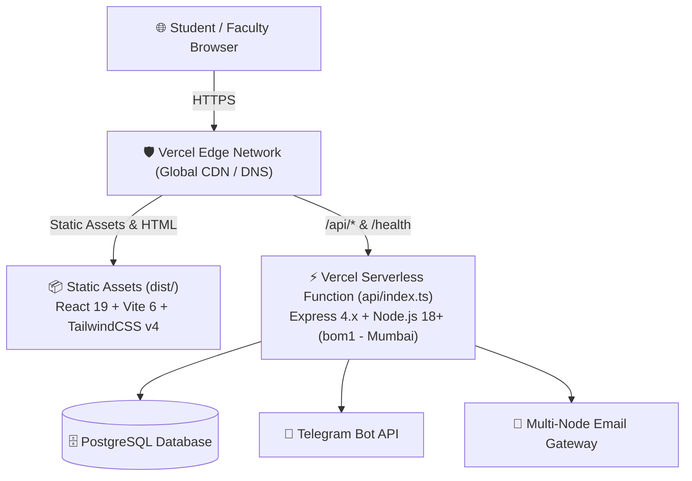

# ⚡ Vercel Deployment Specification & Reference Guide

<div align="center">

[](https://it-taskmanager.vercel.app/)
[](https://it-taskmanager.vercel.app/)
[-blue?style=for-the-badge)](https://vercel.com/docs/edge-network/regions)

### **Production URL**: [https://it-taskmanager.vercel.app/](https://it-taskmanager.vercel.app/)

</div>

---

## 📌 Repository Purpose

This repository is specifically architected, optimized, and maintained for continuous automated deployment on the **[Vercel Platform](https://vercel.com/)**. 

All build pipelines, serverless functions, header optimizations, and static asset caching rules are configured to deliver ultra-low latency, 99.99% uptime, and seamless full-stack execution for VSB Engineering College.

---

## ⚙️ Vercel Project Configuration

The production deployment behavior is governed by [`vercel.json`](../vercel.json):

```json
{
  "version": 2,
  "buildCommand": "npm run build",
  "outputDirectory": "dist",
  "regions": ["bom1"],
  "functions": {
    "api/index.ts": {
      "maxDuration": 30,
      "memory": 1536
    }
  }
}
```

### Key Configuration Highlights:
1. **Zero-Cold-Start Region Optimization (`bom1`)**:
   - Deployed to **Mumbai, India (`bom1`)** data centers, ensuring sub-50ms round-trip latency for students and faculty across Tamil Nadu and South India.
2. **Serverless Function Limits**:
   - `api/index.ts` is allocated **1536 MB RAM** and an extended **30-second execution window** to effortlessly handle heavy Excel generation (`ExcelJS`), multi-tier SQL aggregations, and PDF batching.
3. **Single Page Application (SPA) Client Routing**:
   - All non-API requests gracefully fallback to `/index.html`, preserving React client-side route state (`/`, `/tasks`, `/skill-assessment`, `/placement-readiness`).
4. **Immutable Asset Caching**:
   - Assets in `/assets/(.*)` are served with `public, max-age=31536000, immutable` headers for instant subsequent page reloads.

---

## 🏗️ Architecture on Vercel



---

## 🔐 Required Vercel Environment Variables

To ensure the production deployment operates without errors, configure these environment variables in your **Vercel Project Settings $\rightarrow$ Environment Variables**:

| Variable Name | Type | Description |
| :--- | :--- | :--- |
| `DATABASE_URL` | Secret | PostgreSQL connection string with SSL mode enabled |
| `JWT_SECRET` | Secret | Cryptographic key for stateless JWT authentication |
| `TELEGRAM_BOT_TOKEN` | Secret | Bot authentication token for `@IT_TaskManager_Alerts_bot` |
| `TELEGRAM_GROUP_CHAT_ID` | Config | Target department announcement channel/group ID |
| `CLOUDINARY_CLOUD_NAME` | Config | Cloudinary bucket for identity & submission photos |
| `CLOUDINARY_API_KEY` | Secret | Cloudinary API access key |
| `CLOUDINARY_API_SECRET` | Secret | Cloudinary API secret |
| `VAPID_PUBLIC_KEY` | Config | Web Push notification public key |
| `VAPID_PRIVATE_KEY` | Secret | Web Push notification private key |
| `SENTRY_DSN` | Config | Error monitoring telemetry endpoint |

---

## 🚀 Deployment Command Reference

### Automatic Deployment (Recommended)
Every push to the `main` branch of this GitHub repository triggers an automatic production build and deployment on Vercel.

### Manual CLI Deployment
```bash
# Install Vercel CLI globally
npm i -g vercel

# Link local repository to the Vercel project
vercel link

# Deploy to Preview environment
vercel

# Deploy directly to Production
vercel --prod
```

---

<div align="center">
  <b>VSB Engineering College • Department of Information Technology</b><br/>
  <i>Engineered for High-Availability Vercel Cloud Hosting</i>
</div>
